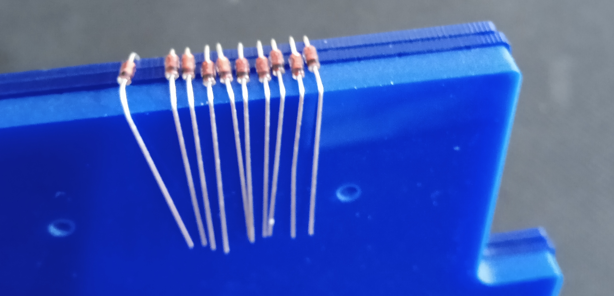

# **Lotus58**

Lotus58 – 58 keys split keyboard 6×4 columnar stagger, 5 thumb cluster. It also has support for addinng OLED's on both halves or Rotary Encoders. It was originally modified from Lily58 Glow and created by [TweetyDaBird](https://github.com/TweetyDaBird/Lotus58).

In this build i'm not going to use any OLED's but instead just have 2 Rotary Encoders on both halves.

## **Build Guide:**

This build guide will be focused on sourcing the parts locally within India.

## **Parts List:**

| Sl.No | Name of part                                              | Qty. | Optional |                                                                          Remarks                                                                          | Link                                                                                                                                                                                                           |                                                                                  Alternate Link                                                                                   |
| :---: | --------------------------------------------------------- | :--: | :------: | :-------------------------------------------------------------------------------------------------------------------------------------------------------: | -------------------------------------------------------------------------------------------------------------------------------------------------------------------------------------------------------------- | :-------------------------------------------------------------------------------------------------------------------------------------------------------------------------------: |
|   1   | Lotus58 PCB’s                                             |  2   |    ❌    |                                          [PCB Power](https://www.pcbpower.com/) or [JLPCB](https://jlcpcb.com/)                                           |                                                                                                                                                                                                                |                                                                                                                                                                                   |
|   2   | PJ-320A TRRS Jack                                         |  2   |    ❌    |                                                                                                                                                           | [link](https://robu.in/product/smartelex-audio-jack-3-5mm-trrs-smd/)                                                                                                                                           | [link](https://www.amazon.in/Audio-Jack-3-5mm-TRRS-SMD/dp/B09B12LBQ2/ref=sr_1_5?crid=19S1IE1H99VO&keywords=TRRS+Jack&qid=1653198174&sprefix=pj-320a+trrs+jack%2Caps%2C874&sr=8-5) |
|   3   | 1N4148 Through Hole Diode                                 | 100  |    ❌    |                       Only 58 required but buy some extra if it's your first time soldering & if you need practice or make mistakes                       | [link](https://stackskb.com/store/1n4148-through-hole-diode/)                                                                                                                                                  |                                                         [link](https://robu.in/product/1n4148-1w-zener-diode-pack-of-50/)                                                         |
|   4   | TTC Pokayoke Hotswap Sockets V2                           |  70  |    ❌    |                                                                                                                                                           | [link](https://stackskb.com/store/ttc-pokayoke-hotswap-sockets-v2-10000-cycles/)                                                                                                                               |                                                                                                                                                                                   |
|   5   | M2 Spacer/Standoff – 15mm threaded                        |  10  |    ❌    |                                                       Go for 10mm if bottom plate thickness is less                                                       | [link](https://thinkrobotics.in/products/aluminium-threaded-spacers-pack-of-4?_pos=1&_psq=spacers&_ss=e&_v=1.0&variant=39717065588822)                                                                         |                                                     [link](https://stackskb.com/store/m2-spacer-standoff-14mm-brass-nickel/)                                                      |
|   6   | M2 Screw – 4 to 8mm                                       |  25  |    ❌    |                                                     If your using 15mm M2 spacer go for 8mm M2 screws                                                     | [link](https://stackskb.com/store/m2-screw-5mm-stainless-steel/)                                                                                                                                               |                                                                                                                                                                                   |
|   7   | 2.54mm 1×40 Male Berg Strip Connector                     |  2   |    ❌    |                                                                                                                                                           | [link](https://makerbazar.in/products/male-berg-strip-40-pins?pr_prod_strat=copurchase&pr_rec_id=0a4876500&pr_rec_pid=1991292092512&pr_ref_pid=1991293501536&pr_seq=uniform)                                   |                                                                                                                                                                                   |
|   8   | 24 Pin Wide DIP IC Socket Base Adaptor                    |  2   |    ❌    |      Optional, Use if you are soldering IC socket adapter & Male Berg strip to PCB, Pro Micro to make the Pro Micro removable & swappable in future       | [link](https://robu.in/product/24-pin-wide-dip-ic-socket-base-adaptor-pack-of-5/)                                                                                                                              |                                                                                                                                                                                   |
|   9   | Lotus58 Top Plate with OLED space - Acrylic 2mm           |  2   |    ❌    |         Using OLED plate design even though i'm using Encoders cause i want to have an option to swap one Rotary Encoder to Oled screen in future         | [link](https://robu.in/product/online-laser-cutting-service/)                                                                                                                                                  |                                                                                                                                                                                   |
|  10   | Lotus58 Bottom Plate - Acrylic 5mm                        |  2   |    ❌    |                                                Go for thickness more than 3mm cause it feels less fragile                                                 | [link](https://robu.in/product/online-laser-cutting-service/)                                                                                                                                                  |                                                                                                                                                                                   |
|  11   | Pro Micro 5V 16M Mini Leonardo Microcontroller            |  2   |    ❌    |                                                                                                                                                           | [link](https://robu.in/product/pro-micro-5v-16m-mini-leonardo-micro-controller-development-board-for-arduino/)                                                                                                 |                                                                                                                                                                                   |
|  12   | TRRS cable                                                |  1   |    ❌    |                                       Optional, you can use an TRS cable like i'm gonna use in my build works fine                                        | [link](https://www.amazon.in/AGARO-Braided-Headphone-Smartphone-33667/dp/B09RPC5TWV/ref=sr_1_7?keywords=agaro+TRS+cable&qid=1668927787&qu=eyJxc2MiOiIwLjgyIiwicXNhIjoiMC4wMCIsInFzcCI6IjAuMDAifQ%3D%3D&sr=8-7) |                     [link](https://www.amazon.in/HKeCART-4-Pole-Spring-Coiled-Auxiliary/dp/B07L1WM8F9/ref=sr_1_14?keywords=TRRS+cable&qid=1653197221&sr=8-14)                     |
|  13   | Rotary Encoder                                            |  2   |    ❌    |                                                                                                                                                           | [link](https://www.amazon.in/CentIoT-Encoder-Digital-Potentiometer-Control/dp/B0888RWNM1/ref=sr_1_2?keywords=CentIoT%C2%AE+-+EC11+10K+Rotary+Encoder&qid=1655392909&sr=8-2)                                    |                                                                                                                                                                                   |
|  14   | Potentiometer Knob Rotary Switch Cap Black Color          |  2   |    ❌    |                                                                                                                                                           | [link](https://robu.in/product/potentiometer-knob-rotary-switch-cap-black-color-pack-of-5-pcs/)                                                                                                                |
|  15   | Plusivo Soldering Kit With Diagonal Wire Cutter           |  1   |    ✅    |                                         Optional, if you already have a decent soldering kit with metal tweezers                                          | [link](https://robu.in/product/plusivo-soldering-kit-with-diagonal-wire-cutter/)                                                                                                                               |                                                                                                                                                                                   |
|  16   | BLANK DSA KEYCAPS (1U)                                    |  70  |    ✅    |                                                                                                                                                           | [link](https://www.meckeys.com/shop/accessories/keyboard-accessories/keycaps/blank/blank-dsa-keycaps-1u/)                                                                                                      |                                                                                                                                                                                   |
|  17   | 1X40 Pins Female Berg Strip Connector Straight Header Pin |  2   |    ✅    | Optional, if you are soldering Female & Male Berg strip to PCB, Pro Micro & don't want Pro Micro to be removable in future for swapping to something else | [link](https://makerbazar.in/products/female-berg-strip-40-pins?utm_source=globoRelatedProducts)                                                                                                               |                                                                                                                                                                                   |

### Numbers in the image above correspond to the number on the parts list

Note:

1. For buying PCB's for the keyboard try the IMKC discord or MkIndia subreddit for people who are selling PCB's or you have to order them yourself from PCB fabricators in which case it's better to join with a couple of friends and order PCB's (maybe 5 or 10 sets) in bulk since it'll be cheaper that way.
2. For buying the cut Acrylic top & bottom plates you have to upload the top & bottom plates designs in `.dxf` format which you can find [here](./plates/).

## **General steps:**

1.  **Soldering the through hole diodes**

    

    - You can use the top & bottom plates stacks to bend the through hole diode legs before soldering them on the PCB.
    - Decide which side of the PCB you want to be the top or bottom for both halves of keyboard since both sides are the same pick one to be top & other to be bottom & remember to solder the diodes on the bottom side of you PCB.
    - Solder the diode by aligning the direction of the black line stamped on the diode and the line marked on the diode on the board. If the orientation is not correct, the key will not respond.
      

      

    - After soldering all the diodes in the correct direction on both PCB's for all Switches (numbered like SW1,SW2 ...),now cut off the excess legs of the diodes with a wire cutter finally it should look similar to this.
      

2.  **Soldering TTC Pokayoke Hotswap Sockets V2**

    

    - Hotswap sockets are needed for making the keyboard hotswappable i.e. to be able to swap out key switches if you want to try out tactile, linear or clicky key switches on your keyboard later on.
    - The socket is attached to the same back side as the diode, align the socket on the socket diagram on the PCB & solder both legs of the socket with good amount of solder.
    - After soldering all the sockets in the correct direction on both PCB's for all Switches (numbered like SW1,SW2 ...)finally it should look similar to this.

    

    **Left half:**
    

    **Right half:**
    

3.  **Soldering PJ-320A TRRS Jack**

    

    - Straighten the legs of TRRS jack from the original flat profile like on the right side from the above image, so that the legs can be placed inside the PCB holes for soldering.
    - Place the TRRS jack on the bottom side of the PCB & solder the 4 straightened legs on the top side like below for both halves of PCB.

    

    

4.  **Soldering the Rotary Encoders**

    

    - Place the Rotary Encoders on the top side of the PCB & solder the 5 legs on the Bottom side like below for both halves of PCB.

    

5.  **Soldering the IC Socket Base Adaptor**

    - Place the IC Socket on the Bottom of the PCB & solder the legs on the top side like below for both halves of PCB. And make sure that the pins are **placed inside rectangles** marking on the top side of the PCB like in the second image below before soldering.

    

    

6.  **Soldering the Male Berg strip on to the Pro Micro controllers**

    - Take the Male Berg strip & solder one side of the legs onto the Pro Micro which is **facing down** on the Bottom side of the PCB so that the other side of the legs fit inside the IC Socket adapter you soldered earlier. It should look similar to the image below and you should be able to remove the Pro Micro along with the Male Berg strip as a single piece.

    

    

7.  **Adding solder onto LH-RH jumpers, Serial pins**

    **Left half Top side of the PCB:**
    

    - Melt solder on the left half Top side of the PCB on the LH jumper & Serial pin to make a connection.

    **Right half Bottom side of the PCB:**
    

    - Melt solder on the Right half Bottom side of the PCB on the Serial pin (as in the image above) & also melt solder on the Right half Top side of the PCB on the RH jumper (not in the image) to make a connection.

8.  **Flashing the Pro Micro**

    

    - Connect the left half to the computer using USB A to Mini B connected to the Pro Micro. Make sure to install [QMK Toolbox](https://github.com/qmk/qmk_toolbox) which i used to flash my boards or [avrdude](https://github.com/avrdudes/avrdude/), which are pretty straight forward as you can see from they're documentation you just need to connect either right/left half of your keyboard separately to the computer then trigger the boot loader mode on your Pro Micro by taking a pair metal tweezers or scissors and shorting(touching) the GND(ground) & RESET pins on your Pro Micro or press reset switch (if you've soldered it which i did not), which you are trying to flash which should cause it to go into boot loader mode. Then you can load the `.hex` file from [here](./flash/lotus58_nerdz.hex) onto QMK toolbox and then click on flash which will cause the Pro Micro to light up with red led, wait a few seconds and when it finishes, disconnect the Pro Micro from the computer & repeat the same thing for the other half of your keyboard. And also a huge thanks to [NerdyPepper](https://github.com/NerdyPepper) for helpful suggestions during the build & providing the hex file which i have used to flash my boards.

    - The hex file used above is generated from qmk firmware using keymaps from [TweetyDaBird](https://github.com/TweetyDaBird/Lotus58), a quick look at the keymaps below for your reference:

    

    - If you want to make your own keymap then you can start from firmware in [TweetyDaBird](https://github.com/TweetyDaBird/Lotus58) or if you want to start from ground up you can follow the [QMK firmware](https://docs.qmk.fm/#/) documentation to make your own keymap.

    - You can insert the key switches into your hotswap socket on your PCB and connect both halves together with the TRS or TRRS cable and connect the keyboard to the computer with USB A to MINI B and finally go to [QMK Key tester](https://config.qmk.fm/#/test) to test and make sure all of your keys are working properly. If they are not working properly then double check the soldering on those keys and test once again.

9.  **Attach the top & bottom acrylic plates to the PCB**

    - Use the M2 Spacer/Standoff, M2 Screw to attach the top plate onto the PCB then similarly attach the bottom plate onto the PCB like this:

    

    

    

    

    

    

    

    

### TroubleShooting:

- If you have any difficulties you can try posting it on IMKC discord or MkIndia subreddit or any Mechanical keyboard subreddit to get help from the community.

## _That's it you finally finished it. Good Job!_
